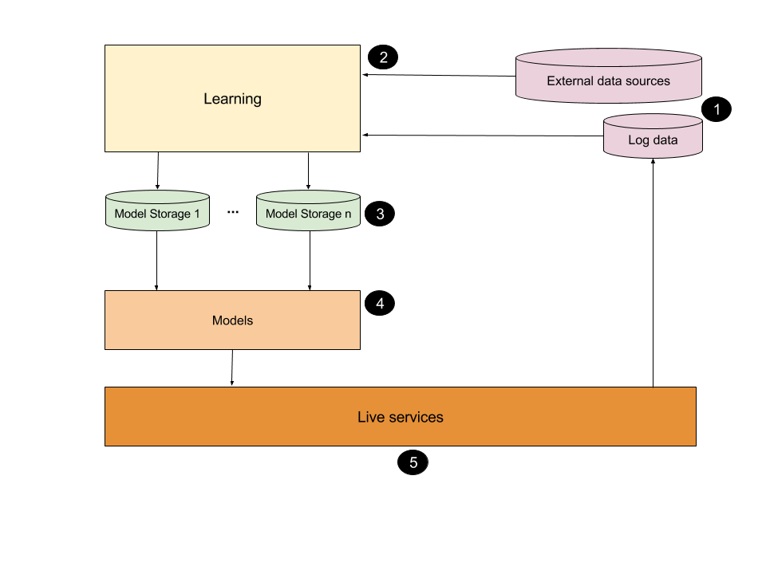

The goal of this document is to describe a high-level architecture for a software project that relies on implementing predictive models trained on data generated from users' past interactions with the system, often in conjunction with other data. (e.g. recommendations, fraud detection, etc.).

### The team
Teams working on such projects are rarely homogeneous: there is almost always a separation between two different roles: software engineers and data scientists.

The engineers typically have a Computer Science background and their main role is to build software systems that run reliably at scale. On the other hand, the data scientists typically have a Statistics or Machine Learning background. Data scientists usually also write code, but they often have more experience with languages that are better suited for data manipulation and less suitable for implementing live services. It is common to consider that data scientists should focus on the science and not write any production code.

But with the right architecture, data scientists can focus on their core skills, writing production code for predictive modeling, without having to tackle too many pure engineering challenges, but also without losing track of how their code integrates with the rest of the system. The architecture should allowfast iteration and make it possible to have data scientists' insights into the data be tested live as soon as they can produce them

### The architecture

#### 1. The data
You cannot have a data-driven product without data so this is a fundamental building block of the whole system. As outlined in the diagram, this includes both the data produced by your system (e.g. logs of user interactions with the system) as well as external data sources. These data sources can be from 3rd party providers or they may be from other teams in the same company.

Some important considerations for these data sources (in as far as there is a choice):
* It is preferred that data formats used are flexible and easy to extend. Always consider the potential need to add new types of records or extending the format of existing records with new data.
* It also helps if data is accessible as a stream before being persisted to durable storage. This makes it possible to implement real-time analysis and modeling on the data, instead of only relying on batch processing, which usually implies a considerable delay between the time the data is produced and the time it is used.

#### 2. Learning
This is where the data scientists do almost all their work. This should be an environment that allows ad-hoc experimentation on the data with any choice of language and tools. The main requirements here are as follows:
* The processing tasks developed by the data scientists should be able to calculate/refresh models fast enough to make them relevant for the business. That is, data scientists have to be aware that at the end of the day they have to write code that is performant enough to be useful in production.
* As long as they meet the first requirement, the data scientists should be free to choose whichever languages or technologies they want.
* The data scientists should find ways to persist the models in the storage systems available, in the correct formats (see below), regardless of the technologies they use to compute their models.

The only piece of infrastructure that is needed here is usually a job scheduler: a tool that can be used to define jobs and their interdependencies and to monitor their execution. Once a new model is a candidate for live testing, a job for its calculation should be scheduled for execution.

#### 3. Model Storage
This layer consists of the different storage solutions that your system supports (relational databases, NoSQL databases, key-value caches, search engines, etc.).
Different instances of model storages should be defined by the conjunction of the following attributes:
* The technology being used. Is this a relational database, a key-value store, etc.? This tells a client of this storage how to connect in order to access the data.
* The format being used. For example, if this is a relational database table, what is the structure of the table? If this is a key-value store, what do the keys and values represent and is some special parsing needed to interpret the values? Again, all this just has to be known by the clients of the model storages.
* The name of this storage. This is the dimension in which the storages need to grow. It should be possible to add new storages with a given underlying technology and a given format but with a new name at the push of a button.

#### 4. Models
This is the key component of the architecture, the one that ties it all together. This layer is best viewed as a self-contained, separate service, developed and maintained by the software engineers, but used by data scientists.
This layer has to be aware of all the different storage technologies and formats available in order to query the model storages, but should be able to discover new storage names without (too much) manual intervention.

This layer is used further downstream by the live services, so it should also expose a certain API, with multiple types of endpoint, each with its own expected input and expected output format, but with multiple implementations of each endpoint type. Again, the clients of this layer should be aware of all these possible types of endpoints, but again it should be possible to discover available implementations of each type.

Adding new implementations should be easy and flexible. Preferably, it should be possible to use arbitrary (e.g. Python) code to implement an endpoint of a certain type. This assumes that an environment is created with convenient methods for accessing model storages.

#### 5. Live Services
This is the layer that the customers/stakeholders interact with. This is where any flaw in the pipeline will surface. Services in this layer typically have to meet strict constraints in terms of performance and reliability. Depending on the type of application, this layer will likely have to implement a lot of logic to meet particular stakeholder requests and these will drive the release schedule. 

