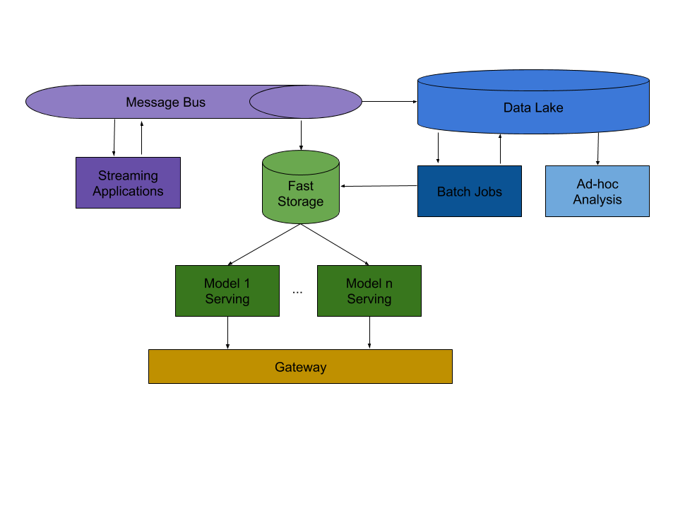

# The main architectural components
The main goal for an architecture of a data driven product is to facilitate fast iteration in terms of uncovering insights from data and bringing live models that extract value from the insights.

This is the high-level diagram highlighting the main broad architectural components:

TODO: Brief descriptions of the components and their roles.

Note: The arrows point in the direction in which the data flow and indicate the main interactions between the different components, but they are not exhaustive. Further interactions between components could be fine.
